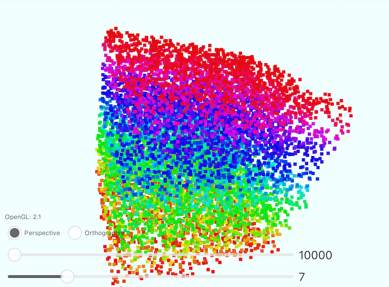
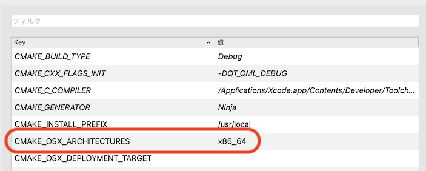

# PointSize_Qt5_3D
QtのQt3Dを使って、ポイントサイズを変更するサンプルアプリ

## Demo

* マウスドラッグでキューブを回せます。
* スライダーでポイント数とサイズを変えられます。

## Features

Qt5のQt3Dを用いて、ポイントクラウドのポイントサイズを変更する方法を示しています。
Qt6.xでも多少の変更で可能と考えられます。

## Requirement

* Qt Creator
* CMake
* Qt 5.15.2

## Note

QMLで、RenderStateSetのPointSizeによってレンダリング時のサイズが変わります。

## Build Settings for M1 mac

このリポジトリはCMakeを使っています。
M1 macではarm64とx86_64を明示的に指定する必要があります。
ビルド設定のCMake > CMAKE_OSX_ARCHITECTURESにx86_64と記述します。
Qt 5.15.4以降はarm64にサポート外ながら[一応対応](https://www.qt.io/blog/qt-on-apple-silicon)しているようです。（このサンプルアプリもM1ネイティブで動作しましたが、スライダーの描画が壊れ気味でした。）

